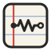

# Circuit Notebook



> The engineering notebook for circuits. Power electronics & control diagram editor — schematics, block diagrams and whiteboards in one place.

_Formerly “Overleagger” and “SchemaBoard”. The internal identifiers (package names, `.olg` files, browser storage)
keep the old name so existing projects and files still open._

**A hierarchical whiteboard for electronics, power electronics and control diagrams** — like
draw.io or CircuitPaint, but made for engineers: symbols that follow the **IEC (EU)** and
**ANSI (US)** standards, wires that snap to a grid with **automatic junction dots**, **blocks you
can open** like sub-sheets, and a **graphite-on-paper / LaTeX** look.

-2f5d9e>)

## Features

### Schematics (phase 1)

- **Grid canvas**: pan (Space / middle mouse / wheel), zoom (Ctrl + wheel, pinch), fit (`F`).
- **About 150 symbols**, each in IEC and ANSI style:
  - passives, coupled inductors, **transformers with 1 to 4 secondaries** (each winding plain or
    centre-tapped, polarity dot at the top, bottom or none), single-line and 3-phase Y/Δ,
    shunt, LDR, ferrite bead;
  - sources (DC, AC, pulse, controlled, 3-phase, PV), grounds and rails;
  - diodes (Schottky, Zener, LED, TVS, varicap…), BJT, JFET, phototransistor, **GaN HEMT
    (e-mode / d-mode)**;
  - **MOSFET N/P, enhancement or depletion, 3 or 4 terminals, with or without body
    (freewheeling) diode, with or without circle**; **IGBT with/without anti-parallel diode**;
  - thyristors (SCR, GTO, IGCT, TRIAC, DIAC), single- and three-phase diode bridges, half/full
    bridge and 3-phase inverter (**adjustable gap between high/low side and between legs**),
    AC/DC… converter blocks, gate driver, isolation barrier;
  - switches, ideal controlled switch, relays, contactor, breaker, machines, meters, sensors and
    probes, generic IC, regulator, ADC/DAC, logic gates;
  - **control blocks** with LaTeX: sum junction, gain, transfer functions, PI, PID, state space,
    integrators, delay, ZOH, saturation, relay, rate limiter, PWM, Clarke/Park, PLL, mux/demux…
- **Reference labels follow the rotation** (like LTspice): a half turn or a mirror moves R1 / V1
  to the opposite side; if a pin is in the way the label goes to the other side.
- **Every part has a size option** (×1.5, ×2, ×3 when the pins stay on the grid).
- **Wires**: orthogonal routing, `/` flips the bend, drag a pin to start a wire, drag a segment to
  move it, wires stretch when parts move **or rotate**. **Junction dots appear automatically**
  where 3 or more connections meet (crossing wires are not connected).
- **Hierarchy**: blocks open like sub-sheets, sheet ports become block pins, unlimited nesting,
  **"move selection into a new block"** (`Ctrl Shift B`).
- **Mirror / rotate everything**: parts, sheet ports and net labels (their shape goes to the
  other side of the connection point), text (alignment), triangles, images.
- **My library** (personal, shared by all your projects, stored in the browser for now):
  - **Your own templates**: select part of a drawing → _Save selection as template_ (Templates tab
    or the bookmark button in the properties). Pick a category or type a new one. Click or drag a
    template to insert it; custom symbols it uses come with it.
  - **Your own symbols**: the symbol editor saves to _My library_ (every project) or to _This
    project only_, in any category you type.
  - Export / import the whole library as an `.olglib` file (ready for future user accounts).

### Whiteboard (phase 2)

- **Pencil** (pen pressure, highlighter), **eraser**, **shapes** (rectangle, ellipse, diamond,
  triangle) with an optional **hand-drawn look**, **lines and arrows** you can curve.
- **Flowcharts and process charts**: ISO 5807 shapes (start/end, process, decision, input/output,
  document, predefined process, database, manual input, preparation, delay, manual operation,
  off-page connector) with text that wraps inside. Start or end a line on a shape and it
  **attaches to a connection point** (shown as dots): the connector follows when the shape moves,
  is resized or changes kind. Right-angle (**elbow**) or straight routing, labels such as
  _Yes / No_ on the connectors, also in the CircuiTikZ export.
- **Sticky notes**, **text with frames** (box, rounded, double, underline) and LaTeX everywhere.
- **Images**: image tool, drag and drop, or paste from the clipboard (downscaled automatically).
- **Link buttons** to a web page / online PDF or to another sheet (Ctrl+click to follow; they stay
  clickable in the PDF).
- **Waveform generator** (oscillograms and chronograms): sine, square, PWM, triangle, sawtooth,
  rectified, DC + ripple, 1st/2nd-order step responses, exponential, custom points; presets such
  as buck chronogram, PWM carrier, three-phase voltages.
- **Frames** to organise the board (the base of the coming presentation mode).
- **Custom symbol editor**: lines, polylines, rectangles, circles, texts and pins on a grid; start
  from any built-in symbol ("Customize symbol…") and save it to your library or to the project.
- **Align and distribute**, **project colour palette**, fills, three themes: **cream lab
  notebook**, **white whiteboard** and **blackboard**, with drafting-style ("non-photo blue")
  selection marks.
- **Small animations** that stay discreet: parts pop in when placed (with a graphite ring), settle
  when dropped, fade out when deleted; new junction dots pop; a blue ring marks a new connection;
  smooth zoom-to-fit. Toggle them with the ✦ button (they are off automatically when the system
  asks for reduced motion).

- **Links on anything** (shapes, images, text, notes, parts, lines): a web page / online PDF or
  a sheet of the project. Ctrl+click follows it; a small ↗ tag marks linked elements.

### Presentation (phase 3)

- **Present** (`F5`): the frames of every sheet become slides (reading order), sheets without
  frames are shown whole. Smooth zoom between slides.
- **Click a block to dive into its sub-sheet** (zoom transition), `Backspace` to come back up;
  links and sheet ports are clickable too.
- **Laser pointer** (`L`), **pen** (`P`, nothing is saved, `C` clears), **blank screen** (`B`),
  `←/→`, `Space`, `Home/End`, `Esc` to leave.

### Collaboration (phase 4)

Everything above works offline in the browser. Connect to a **Circuit Notebook server** (your own,
see _Self-hosting_) to share projects:

- **Accounts**: email + password, or GitHub sign-in when the server enables it. Your personal
  library (symbols and templates) follows your account.
- **Shared projects**: create a project on the server, or upload one from this browser
  (_Share_ button or ☁ on the project card). They open instantly and keep working offline; the
  changes sync when you are back online.
- **Invite links** with a role: **owner** (people, links, sheet locks), **editor**, **commenter**
  (comments only), **viewer** (look, present, export). The server checks every change against
  the role, not only the interface.
- **Real time**: live edits, **cursors with names**, others' selections, avatars in the top bar
  — click one to **follow their view**; “X is presenting — Join” follows their slides.
- **Comments** (tool `C`): threads pinned on the drawing, replies, resolve, a list of all threads
  in the _Comments_ tab. They also work in local projects, as notes to yourself.
- **Sheet locks**: the owner locks a sheet (Sheets tab) so only they can change it.
- **Version history**: a version is kept automatically every few minutes; name one with _Save_;
  preview and **restore** (the current state is saved first, so nothing is lost).

### Files and export

- Projects saved automatically in the browser (IndexedDB), `.olg` project files to back up/share.
- **Smart PDF**: one page per sheet, bookmarks that mirror the hierarchy (with frames), clickable
  blocks → sub-sheet, **sheet ports → parent sheet**, links on any element, a header link back to
  the parent sheet, and **sticky notes as PDF comments**.
- **SVG and PNG** of the current sheet.
- **CircuiTikZ / LaTeX**: the current sheet as `circuitikz` code (complete document or just the
  environment). R, C, L and diodes use native CircuiTikZ symbols; every other part is drawn
  exactly as on screen, with `$…$` math kept as LaTeX.
- **Keyboard shortcuts** for everything, re-bindable (`?` shows them all).

## Getting started

Requirements: Node ≥ 22.12 and pnpm 10.

```bash
pnpm install
pnpm dev          # http://localhost:5173 (homepage), http://localhost:5173/app/ (editor)
```

The site has two pages: the **homepage** (`apps/web/index.html`, plain HTML + CSS, no React) and
the **editor** (`apps/web/app/index.html`). Old links such as `/#/p/<id>` are sent on to `/app/`.

Other commands:

| Command          | What it does                            |
| ---------------- | --------------------------------------- |
| `pnpm build`     | Production build in `apps/web/dist`     |
| `pnpm test`      | Unit tests (Vitest)                     |
| `pnpm test:e2e`  | End-to-end tests (Playwright, Chromium) |
| `pnpm typecheck` | TypeScript checks of every package      |
| `pnpm lint`      | ESLint                                  |
| `pnpm format`    | Prettier                                |

The build is a static site (`base: './'`), so it can be hosted on any static host. The workflow
`.github/workflows/pages.yml` publishes it on **GitHub Pages** on every push to `main`
(one-time setup: repository _Settings → Pages → Source: GitHub Actions_).

To work on the collaboration server: `pnpm --filter @overleagger/server dev` (port 8787), then
_Connect to a server_ → `http://localhost:8787` in the app.

## Self-hosting (collaboration server)

One container holds the web app and the server (Node 22, Fastify, Hocuspocus/Yjs, SQLite):

```bash
docker compose up -d        # → http://localhost:8787
```

Data (accounts, projects, versions) lives in the `circuit-notebook-data` volume — back it up by
copying `/data/circuit-notebook.sqlite`. Settings (environment variables, see `docker-compose.yml`):

| Variable                                    | Default                         | Meaning                                                     |
| ------------------------------------------- | ------------------------------- | ----------------------------------------------------------- |
| `PUBLIC_URL`                                | `http://localhost:8787`         | Public address (invite links, GitHub sign-in)               |
| `ALLOW_SIGNUP`                              | `true`                          | `false`: new accounts only through an invite link           |
| `CORS_ORIGINS`                              | `*`                             | Web app origins allowed to call the API (e.g. GitHub Pages) |
| `GITHUB_CLIENT_ID` / `GITHUB_CLIENT_SECRET` | —                               | Enables “Continue with GitHub”                              |
| `DB_FILE`                                   | `/data/circuit-notebook.sqlite` | SQLite file                                                 |
| `SESSION_DAYS` / `AUTO_VERSION_MINUTES`     | `30` / `10`                     | Sign-in lifetime / time between automatic versions          |
| `TRUST_PROXY`                               | `false`                         | `true` behind a reverse proxy or Cloudflare Tunnel          |

Put it behind HTTPS (Caddy, nginx, Traefik…) for real use: WebSockets go through `/collab`. The
GitHub Pages version of the app can use any server: _Connect to a server_ on the dashboard.

A step-by-step plan for a public deployment (Hetzner + Cloudflare, backups, legal, launch) is in
[`docs/DEPLOY.md`](docs/DEPLOY.md).

## Architecture

```
packages/symbols   Symbol library: primitives in grid units, IEC/ANSI variants, options, search
packages/core      Document model (Yjs), geometry, connectivity (junctions, nets), hierarchy,
                   move/rotate/mirror, groups, clipboard, reference designators
apps/web           React + Vite editor: SVG canvas, tools, panels, shortcuts, LaTeX, export
apps/server        Collaboration server: Fastify API, Hocuspocus sync, SQLite, auth, history
```

- The document is a **Yjs** CRDT (`meta`, `sheets`, `symbols`, `comments`, `locks`). Each element
  is a `Y.Map`, so concurrent edits of different fields merge cleanly. The server applies each
  incoming update to a copy of the document to see which parts it touches, and refuses it when
  the sender's role does not allow it (`packages/core/src/collab.ts`).
- Junction dots are **computed, never stored**: at every wire end or pin, a wire end counts 1
  branch, a wire passing through counts 2, a pin counts 1; three or more branches → a dot.
- Symbols are plain data (`line`, `poly`, `circle`, `arc`, `rect`, `path`, `text`) built by small
  functions, so one MOSFET definition gives every variant.

## Roadmap

- ~~Phase 1 — Core editor~~ ✔
- ~~Phase 2 — Whiteboard~~ ✔
- ~~Phase 3 — Presentation & smart PDF, CircuiTikZ export~~ ✔
- ~~Phase 4 — Collaboration~~ ✔
- **Phase 5 — Extras**: SPICE netlist, BOM.

## Licences

Code: to be decided by the project owner. Fonts: Computer Modern Unicode (SIL Open Font Licence,
see `apps/web/public/fonts/OFL.txt`).
